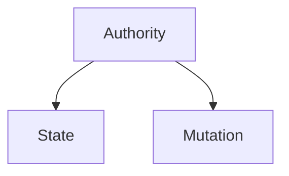
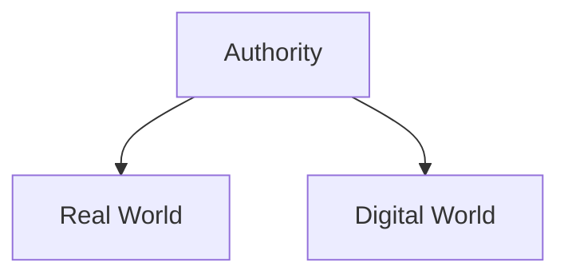
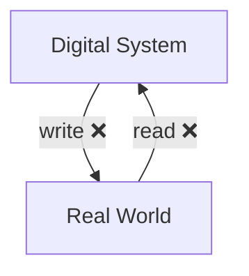

---
{"dg-publish":true,"permalink":"/blockchain-reimagined/content/more-on-authorities/","hide":true,"created":"2024-08-12T00:26:44.599+07:00","updated":"2024-10-26T20:15:55.791+07:00"}
---

[[Blockchain-Reimagined/Content/What Is This All About?\|What Is This All About?]] briefly touched upon the nature of trust and authorities. In this chapter, we will dive deeper into both. 
## Need

We need authorities and trust, because of our **scale**: We are simply too many humans to be able to directly trust one another.

Consider the following: 
- In a group 4 friends, we blindly trust each other based on personal knowledge. 
- In a group of 20, we easily rely on second-hand trust: if my friend trust them, so should I. 
- In a village of a few hundred, you already start to see the need for a leader, an authority, to settle disputes, should one arise. 
- When the size of the collective rises to millions, like a nation, we establish entire sets of organizations designed to establish trust: 
	- Banks: who owns credit and debit
	- Land registry: who owns what land
	- Patent registration: who owns which intellectual property
	- Regulatory bodies
	- Tax authorities
	- Notaries
We can observe the same pattern in non-government areas as well: 
	- Domain Name Servers

Therefore, the overall need for authorities is unavoidable when we live in large collectives. 
## Mutation and State

Most authorities can be abstracted as two functions: They hold value-bearing and contentious ***state*** (information), and they perform ***mutations*** upon that state.

In the example of owning digital money in [[Blockchain-Reimagined/Content/What Is This All About?\|What Is This All About?]], the state of the authority is the ledger of all accounts and balances, and the mutations are transfers between two accounts. 
## Digital and Real World 

Another property of authorities is whether the state that they hold, and the mutations that are done upon it, are in the ***real world***, or the ***digital world***. 

**Banking**, excluding cash, and many similar financial services, are examples of authorities that are purely **digital**. The state is a ledger holding everyone's balance, which is merely a set of numbers in a computer. Updating one's balance is as simple as updating one of these numbers.

Conversely, the **land registry** is a **real world form of authority**. Such an authority needs to be able to know if a land exists, who owns it, and crucially enforce the ownership of it through some law enforcement mean, if need be. 

<a class="markdown-embed-link" href="/blockchain-reimagined/axioms/axiom-oracle-problem-in-authorities/" aria-label="Open link"><svg xmlns="http://www.w3.org/2000/svg" width="24" height="24" viewBox="0 0 24 24" fill="none" stroke="currentColor" stroke-width="2" stroke-linecap="round" stroke-linejoin="round" class="svg-icon lucide-link"><path d="M10 13a5 5 0 0 0 7.54.54l3-3a5 5 0 0 0-7.07-7.07l-1.72 1.71"></path><path d="M14 11a5 5 0 0 0-7.54-.54l-3 3a5 5 0 0 0 7.07 7.07l1.71-1.71"></path></svg></a>

For an authority to successfully establish trust in any matter, it needs to be able to readily read the state related to that matter, and readily write updates to it. We formerly named these writes as "mutations".

Therefore, if an authority wishes to establish trust a real world matter, it needs a way to both read information from the real world, and enforce updates in the real world. 
### Oracle Problem 
The often overlooked reality is: Blockchains, as discussed so far, are obviously digital systems. **For a digital system, introspection of the real world is (nearly) impossible to do *independently***. This difficulty, specifically when it comes to reading information from the real world, is referred to as the [[Blockchain-Reimagined/Appendix/Oracle Problem\|Oracle Problem]].

In more detail, a digital system, such as a Blockchain, has no practical way to *independently* understand if a piece of land exists, and to whom it belongs. Moreover, a digital system cannot meaningfully enforce that "*Person A should from now on own this land that formerly belonged to person B*".

> [!TIP] Real World Fallacy 
> A very common fallacy in the blockchain space is applications that create a blockchain, selling its [[Blockchain-Reimagined/Glossary/Resilience\|Resilience]] , but they have a clear bottleneck in which a centralized authority need to sit in between the blockchain and the outside world, and solve the [[Blockchain-Reimagined/Appendix/Oracle Problem\|Oracle Problem]]. I believe a lot of companies aiming to bring real-world-assets into blockchains are fundamentally mislead by overlooking this fact.

This is why very often real world authorities are backed by some form of ***law enforcement unit***, such as the police and military, as noted in [[Blockchain-Reimagined/Content/What Is This All About?\|What Is This All About?]]. No blockchain based system yet has a real world law enforcement body behind it[^1].

[^1]: The Network State book proposes steps through which digital authorities can evolve into gaining legitimacy in the real world, which is very much related to the enforcement issue mentioned above.

Contrary, blockchains can effortlessly harvest their full [[Blockchain-Reimagined/Glossary/Resilience\|Resilience]] on use-cases whose state is purely digital. This property demonstrates why Decentralized Finance (DeFi henceforth) is such a successful use-case for blockchains. Assuming a free and open internet[^2] upon which information can be exchanged, DeFi requires no further substrate to operate upon. 
[^2]: How accurate is this assumption of the internet being "free"? See [[Blockchain-Reimagined/Appendix/The Free Internet\|here]]. 

### Weakest Link

This is NOT to say that no blockchain based system should attempt to tackle any real-world use-case. But, we should acknowledge that there is a high chance to create a system with a single-point-of-failure here. 

Very often, such systems combine a blockchain and its science-based trust with a human-based authority that conveys the existence of real-world information to and from the blockchain, and this human-based authority is exactly the single point of failure[^3]. This design might suffer from the weakest link issue: 

<a class="markdown-embed-link" href="/blockchain-reimagined/axioms/axiom-weakest-link/" aria-label="Open link"><svg xmlns="http://www.w3.org/2000/svg" width="24" height="24" viewBox="0 0 24 24" fill="none" stroke="currentColor" stroke-width="2" stroke-linecap="round" stroke-linejoin="round" class="svg-icon lucide-link"><path d="M10 13a5 5 0 0 0 7.54.54l3-3a5 5 0 0 0-7.07-7.07l-1.72 1.71"></path><path d="M14 11a5 5 0 0 0-7.54-.54l-3 3a5 5 0 0 0 7.07 7.07l1.71-1.71"></path></svg></a>

The strength of any chain is only as strong as its weakest link. 

While a useful term in the industries that work with an actual chain, the analogy can be expanded to composite (digital) systems with interdependent constituents as well.  

In our case, the overall [[Blockchain-Reimagined/Glossary/Resilience\|Resilience]] of a composite [[Blockchain-Reimagined/Glossary/Authority\|Authority]] is only as good as its weakest component.

Originally appearing in "Essays on the Intellectual Powers of Man".

## Summary 

Any [[Blockchain-Reimagined/Glossary/Authority\|Authority]]'s role is to establish [[Blockchain-Reimagined/Glossary/Trust\|Trust]]. Blockchains are systems that yield [[Blockchain-Reimagined/Glossary/Resilience\|Resilience]] science-based trust, instead of the old-school human-based trust. 

An authority typically needs to hold some contentious state and perform mutations on top of it. This state is either in the real world or the digital world. 

Digital state is a great fit for blockchains, since it can be easily mutated. Real world matters are more difficult, due to the [[Blockchain-Reimagined/Appendix/Oracle Problem\|Oracle Problem]]. 

While we can strive to solve the [[Blockchain-Reimagined/Appendix/Oracle Problem\|Oracle Problem]] to be solved in a [[Blockchain-Reimagined/Glossary/Resilience\|Resilience]] manner, turning a blind eye to it will likely create more damage than harm, as it is a [[Blockchain-Reimagined/Axioms/Axiom - Weakest Link\| single point of failure]] for a system.  

[^3]: In some sense, I am debunking the entire class of "*Let's tokenize this Rolex and put it on a blockchain*" ideas, or at least claiming that they are a big compromise in [[Blockchain-Reimagined/Glossary/Resilience\|Resilience]]. There is no meaningful way for a blockchain to know about the existence of a Rolex, other than introducing another form of human-based authority/oracle that needs to be trusted.
