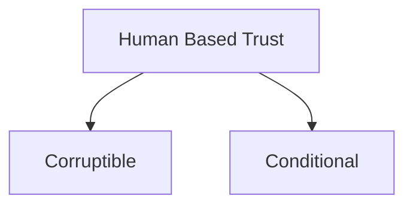
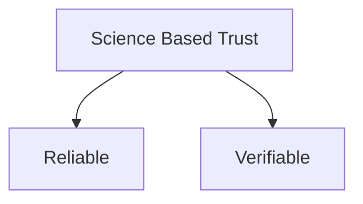
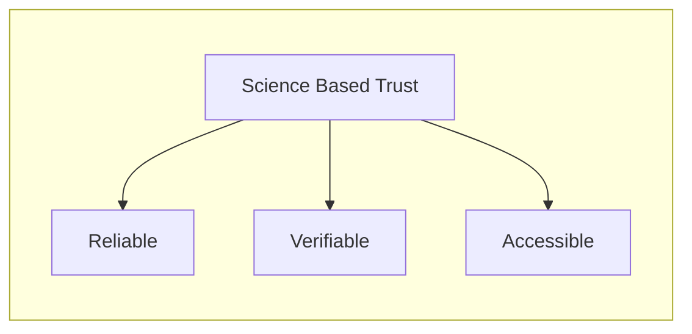
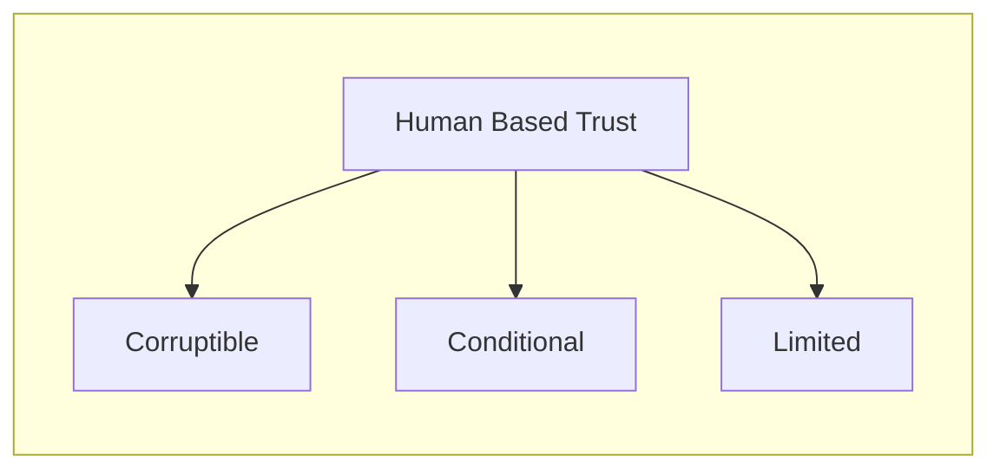

---
{"dg-publish":true,"permalink":"/blockchain-reimagined/content/what-is-this-all-about/","hide":true,"created":"2024-09-13T19:41:43.296+01:00","updated":"2024-10-26T14:15:55.790+01:00"}
---

> Promise to forget everything you know about blockchains, and follow me step by step. I promise it will make sense.

## Owning Digital Money 

In order to understand what Blockchains are all about, let's dive right into 
the age-old example of owning digital money:

1. When you own €1000 in your bank
2. When you own 1000 SATOSHIs in the Bitcoin network

How is it that we trust each of them to exist, and be credible? 
### Bank 
In the former, as little as one computer in the world, owned by the said bank, can store the information that you own €1000. When you want to transact with your €1000, you need to authorize yourself to this one computer. 

And why do we trust the bank in this case? Probably something that most of us take for granted and don't bother too much with. But, if you dig further, you will soon see that banks are trustworthy, because they are backed by a central bank. Central banks are backed by government, and audited by regulators. Finally, governments have access to military, which is the ultimate reason we trust the system: Law enforcements. 

All such forms of trust have a critical property in common: They are based on humans acting a certain way, not a hard law of nature. And this entails a few secondary properties:
- They are **conditional**: The human(s) in charge might decide to *not take action* when they were expected.
- They are **corruptible**[^3][^4]: The human(s) in charge might decide to take a different action than what was expected.

[^3]: As said by Yuval Noah Harari, humanity's ability to establish such human-oriented institutions and giving them power is arguably the main reason of our advent, yet as we have seen in any anecdotes, it is also our Achilles hill: We are, not enlightened Elfs, nor sturdy dwarfs, but rather greedy, corruptible humans. When given power, we sometimes but rush to abuse it.
[^4]: You can similarly see traces of this in the founding father's of America, trying to limit the amount of power given to the federal government. 

We call these entities that we create, give power to, and then [[Blockchain-Reimagined/Glossary/Trust\|Trust]], an [[Blockchain-Reimagined/Glossary/Authority\|Authority]]. 
### Bitcoin
With the advent of Bitcoin, a number of thinkers started to imagine: How could we build a system that is *as trustworthy as the aforementioned*, yet its reasons for trust are rooted not in humans, but rather in science, and well understood laws thereof. Such trust would be less susceptible to any sort of **Corruption or Conditionality**. It would instead be: **Verifiable, and Reliable Trust**.

In the Bitcoin network, such branches of science are most notably cryptography, economics, and distributed system. The main discovery of Bitcoin was that if one combines these branches of science together, they build a system that is *equally trustworthy* for behaving according to certain rules, yet it requires no [[Blockchain-Reimagined/Glossary/Trust\|Trust]]-worthy human, or an [[Blockchain-Reimagined/Glossary/Authority\|Authority]] to sit in the center. 

And the Bitcoin network is exactly one example of that: A simple bank, with the ability with anyone to open an account in it, with basic rules that allow transfer of value. Bitcoin demonstrated that one can build such a system. 

Let's look at an illuminating example. 

One of the pillars of the traditional banking system is for you to visit a branch, provide some documents and a signature, and sign up for an account. Perhaps you would also provide a pin in person, which you can later use with a card to authenticate yourself. This process is human-based, and works most of the time, but we can be sure that there have been cases of impersonation in a branch of a bank.

Contrary, in the Bitcoin network, public-key cryptography is used to authenticate users. This is a very well known method[^1] to allow one to digitally sign information and attest to the ownership of a key. Public key cryptography doesn't work because an employee at a bank branch does their job correctly. It doesn't work because a said country has a very powerful military. It works because of its known properties, no matter who or where you are.  

[^1]: It is not an overstatement to say public key cryptography is the backbone of the entire internet. Every time you open a website which uses HTTPS, this technology is used in multiple rounds. 

### Commoditization 
Let's look at another aspect of the above example. 

Establishing a bank and a currency is not something that I can go on and do by myself. The nature of Human-based trust is that it is not accessible to all. This is no fault of any particular person, but rather the consequence of this type of trust. As noted above, a strong array of regulatory and law enforcement apparatus is needed to ensure the correctness of an [[Blockchain-Reimagined/Glossary/Authority\|Authority]] relying on human-based [[Blockchain-Reimagined/Glossary/Trust\|Trust]]. 

Contrary, science-based trust requires less overhead to ensure its correctness, and therefore can be established by significantly more number of people. 

This is exactly a step towards a process known as commoditization: A good once seen as special, becoming more and more accessible to the general public. 

A few examples of this: 
- People easily created multiple variants of Bitcoin itself
- Ethereum ICOs being an accessible equivalent to IPOs
- Decentralized Finance being an accessible equivalent to financial products
- Memecoins being an accessible equivalent to gambling

Consider how in each example, setting up the authority needed to execute the given action (a new bank, IPO, a financial product, casino) is quite hard to achieve in the real world if it were to be trustworthy, yet is much easier in the blockchain world. 

TODO: study the process of commoditization of a few more things. There has always been some abuse at first, but eventually it is a step forward for humanity. 
## Summary: Blockchain What? 

This is really what blockchain-based technology is all about: Commoditizing the ability to establish an [[Blockchain-Reimagined/Glossary/Authority\|Authority]] and form [[Blockchain-Reimagined/Glossary/Trust\|Trust]] in them, with superior properties compared to the of the human-based trust. 

Human-based [[Blockchain-Reimagined/Glossary/Trust\|Trust]] is corruptible and conditional. Science-based trust, such as that of Bitcoin, is verifiable and reliable. 

> We summarize these properties that blockchain-based systems bring about as [[Blockchain-Reimagined/Glossary/Resilience\|Resilience]]. Blockchains are a more resilient way to establish trust. 

We also discussed accessibility: In the past, I could not just write down the the logic of a digital bank in a programming language, run it on my server, and expect everyone to trust me do it right. 

Bitcoin was the first demonstration that you can. It was the first digital bank, establishing [[Blockchain-Reimagined/Glossary/Trust\|Trust]] without a central [[Blockchain-Reimagined/Glossary/Authority\|Authority]]. This was the first step towards commoditization of money[^5].
[^5]: Blockchain based technologies has been very successful at commoditizing creation of digital money, yet its Achilles heel is the on and off ramp matter: That most of the poeple holding such assets are tied to the existence of centralized crypto exchanges, which are by all means based upon human-based trust, and therefore suffer from the same issues. More about this in [[Blockchain-Reimagined/Appendix/On and Off Ramp\|On and Off Ramp]]. 

Ethereum took the same idea to the next step and allowed more general forms of computation to be executed under the same trustworthy umbrella: A global [[Blockchain-Reimagined/Glossary/Trust\|Trust]]-worthy computer. A standard like ERC-20 on Ethereum, allowing almost anyone to create a token that is trade-able against ETH was the completion of the commoditization process. Almost anyone could now create one such token.

Don't be mistaken, most of these tokens still ended-up being worthless. But the crucial points is that they were no longer bottlenecked by the lack of trust. 