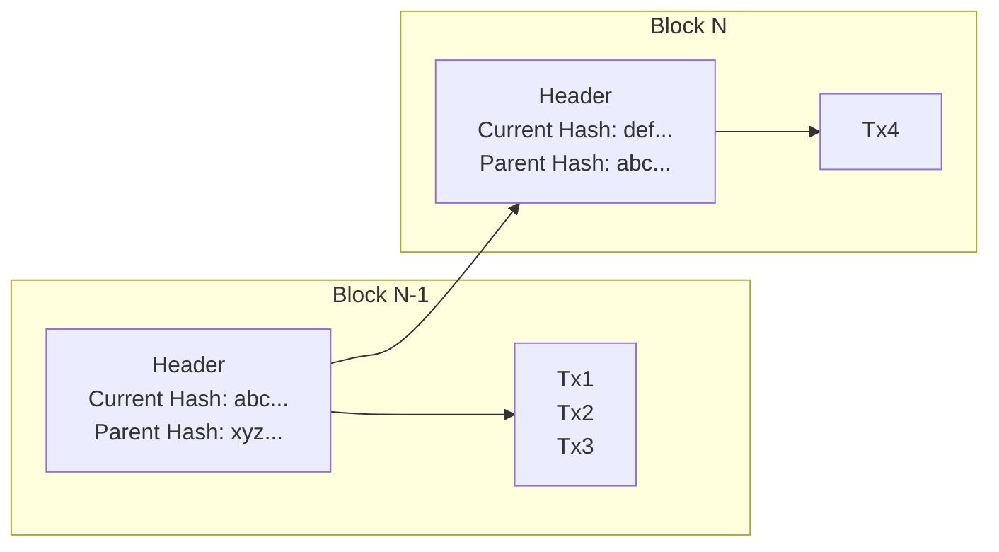

---
{"dg-publish":true,"permalink":"/blockchain-reimagined/content/what/blockchains-are-overrated/","hide":true,"created":"2024-10-26T11:17:48.692+01:00","updated":"2024-12-29T12:51:03.957+00:00"}
---

The title of this (brief) chapter might strike you as a surprise, but it is by all means true, and in encapsulates a very interesting realization: 

Blockchain, as a data structure, is overrated, as it only helps with correct ordering and audit-ability of the history. Blockchain is NOT the technology that delivers verifiable execution *at all*, or even establish *what* the correct order should be. 

Let's dive further into understanding *what* Blockchains actually are, and then revisit this proposition at the end.
## Blockchain

Imagine we have an establish correct order of 3 transactions[^1]. Without any special means, how can we append a 4th one, while retaining the previous order neatly?

[1^]: recall from [[Blockchain-Reimagined/Appendix/Blockchain Models\|Blockchain Models]] that transaction is synonym to a transition or mutation to the blockchain.

Blockchain is solving this problem.

A blockchain proposes to: 
- Bundle all transactions that are being added, in the right order, into a single *block of transactions*
- *Chain* these blocks together by referencing a [[Blockchain-Reimagined/Appendix/Cryptographically Secured Hash\|Cryptographically Secured Hash]] of the previous block

In the above diagram, 

Summary: Blockchain is an append-only list of transactions, with an easy way to ensure the history is not tampered with. 
## Overrated? 

## Resilience

Blockchains are a means to an end; the goal is to create [[Blockchain-Reimagined/Glossary/Resilience\|Resilience]] systems, or perhaps a [[Blockchain-Reimagined/Glossary/Resilience\|Resilience]] web that we may call [[Blockchain-Reimagined/Glossary/Web3\|Web3]]. 