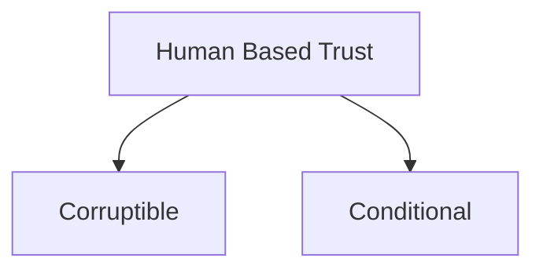
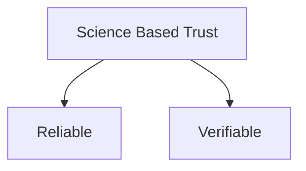
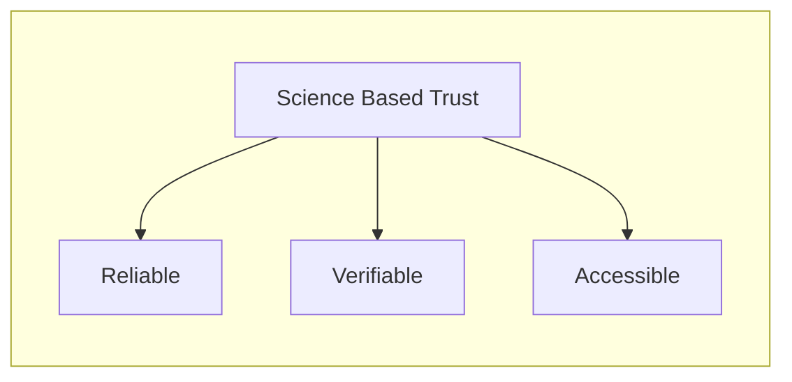
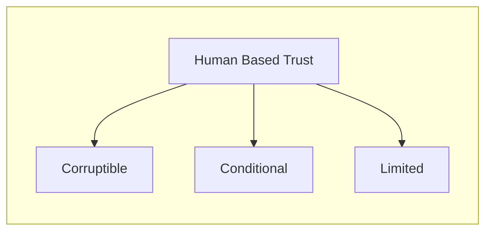

---
{"dg-publish":true,"permalink":"/blockchain-reimagined/content/what/what-is-this-all-about/","hide":true,"created":"2024-09-13T19:41:43.296+01:00","updated":"2024-12-28T11:23:34.350+00:00"}
---

## Owning Digital Money 

In order to understand what Blockchains are all about, let's dive right into 
the age-old example of owning digital money:

1. When you own €1000 in your bank
2. When you own 1000 SATOSHIs in the Bitcoin network

How is it that we trust each of them to exist, and be credible? 
### Bank 
In the former, as little as one computer in the world, owned by the said bank, can store the information that you own €1000. When you want to transact with your €1000, you need to authorize yourself to this one computer or entity. 

And why do we trust the bank in this case? Probably something that most of us take for granted and don't bother too much with questioning. But, if you dig further, you will soon see that banks are trustworthy because they are backed by a central bank. Central banks are backed by government, and audited by regulators. Finally, governments have access to military, which is the ultimate reason we trust the system: **Law enforcements**. 

All such forms of trust have a critical property in common: They are based on humans acting based on a set of *rules*, not [hard-science](https://en.wikipedia.org/wiki/Hard_and_soft_science). And this entails a few secondary properties:
- They are **conditional**: The human(s) in charge might decide to *not take action* when the rules expected.
- They are **corruptible**[^3][^4]: The human(s) in charge might decide to take a different action than what the rules expected.

[^3]: As said by Yuval Noah Harari, humanity's ability to establish such human-oriented institutions and giving them power is arguably the main reason of our advent, yet as we have seen in many anecdotes, it is also our Achilles hill: We are, not enlightened Elfs, nor sturdy dwarfs, but rather greedy, corruptible humans. When given power, we sometimes but rush to abuse it.
[^4]: You can similarly see traces of this in the founding father's of America, trying to limit the amount of power given to the federal government. 

We call these entities that we create, and then put our [[Blockchain-Reimagined/Glossary/Trust\|Trust]] into, an [[Blockchain-Reimagined/Glossary/Authority\|Authority]]. 
### Bitcoin
With the advent of Bitcoin, a number of thinkers started to imagine: How could we build a system that is *as trustworthy as the aforementioned*, yet its reasons for trust are rooted not in humans, but rather in science, and well understood laws thereof. Such trust would be less susceptible to any sort of **Corruption or Conditionality**. It would instead be: **Verifiable, and Reliable Trust**.

In the Bitcoin network, such branches of science are most notably cryptography, economics, and distributed system. The main discovery of Bitcoin was that if one combines these branches of science together, they build a system that is *equally trustworthy* for behaving according to certain rules, yet it requires no [[Blockchain-Reimagined/Glossary/Trust\|Trust]]-worthy human, or an [[Blockchain-Reimagined/Glossary/Authority\|Authority]] to sit in the center. 

And the Bitcoin network is exactly one example of that: A simple bank, with the ability with anyone to open an account in it, with basic rules that allow transfer of value. 

Bitcoin's main novelty is demonstrating that this technology is possible. 

Let's look at an illuminating example. 

One of the pillars of the traditional banking system is for you to visit a branch, provide some documents and a signature, and sign up for an account. Perhaps you would also provide a password in person, which you can later use with a card to authenticate yourself. This process is human-based, and works most of the time, but we can be sure that there have been cases of impersonation in a branch of a bank.

Contrary, in the Bitcoin network, public-key cryptography is used to authenticate users. This is a very well known method[^1] to allow one to digitally sign information and attest to the ownership of a key. 

Public key cryptography *doesn't work because an employee at a bank branch does their job correctly*. It doesn't work because a said country has a very powerful central bank, regulatory bodies, and military. It works because of hard-science determining it works, no matter who or where you are.

[^1]: It is not an overstatement to say public key cryptography is the backbone of the entire internet. Every time you open a website which uses HTTPS, this technology is used in multiple rounds. 

### Commoditization 
Let's look at another aspect of the above example. 

Establishing a bank and a currency is not something that I can go on and do by myself. The nature of Human-based trust is that it is not *accessible* to all. This is no fault of any particular person, but rather the consequence of this type of trust. As noted above, a strong array of regulatory and law enforcement apparatus is needed to ensure the correctness of an [[Blockchain-Reimagined/Glossary/Authority\|Authority]] relying on [[Blockchain-Reimagined/Glossary/Trust#Human-based Trust\| Human-based Trust]]. 

Contrary, [[Blockchain-Reimagined/Glossary/Trust#Science-based Trust\|Science-based Trust]] requires less overhead to ensure its correctness, and therefore can be established by significantly more number of people. 

This is exactly a step towards a process known as Commoditization: A product, once seen special, becoming more and more accessible to the public. Today, almost anyone can launch a token using Blockchain-based technologies. Decentralized Exchanges can allow this new token to be traded with other value-bearing tokens, organically transforming it into a currency with a market-determined value. Read more about this in the [[Blockchain-Reimagined/Appendix/Commodatization\|Commoditization appendix]].

Therefore, we can add a third property to each category of [[Blockchain-Reimagined/Glossary/Trust\|Trust]]: Accessibility and Limited.

## Summary 

This is really what blockchain-based technology is all about: Commoditizing the ability to establish an [[Blockchain-Reimagined/Glossary/Authority\|Authority]] and embed [[Blockchain-Reimagined/Glossary/Trust\|Trust]] in them, with superior properties of science based trust, compared to that of the human-based trust.

Human-based [[Blockchain-Reimagined/Glossary/Trust\|Trust]] is corruptible, conditional and limited. Science-based trust, such as that of Bitcoin, is verifiable, reliable and accessible. 

> We summarize these properties that blockchain-based systems bring about as [[Blockchain-Reimagined/Glossary/Resilience\|Resilience]]. Blockchains are a more resilient way to establish trust. 

Bitcoin was the first demonstration that you can do this. It was the first digital bank, establishing [[Blockchain-Reimagined/Glossary/Trust\|Trust]] without a central [[Blockchain-Reimagined/Glossary/Authority\|Authority]]. This was the first step towards commoditization of money[^5].

Ethereum took the same idea to the next step and allowed more general forms of computation to be executed under the same trustworthy umbrella: A global [[Blockchain-Reimagined/Glossary/Trust\|Trust]]-worthy computer.  

A standard like ERC-20 on Ethereum allowed almost anyone to create a token that is trade-able against ETH via Decentralized Exchanges. Almost anyone could now create one such token. Don't be mistaken, most of these tokens still ended-up being absolutely worthless. But the crucial points is that they creation of them was no longer bottlenecked by the lack of trust. Their value converging to zero is not a a sign of any shortcoming in Blockchain systems, but rather their advantage: Because *ANYONE* could now create a token, of course many of them ended up being worthless.  

Now, you might ask, can I use blockchains to establish trust in any scenario that requires trust? **No**. Blockchains are end of the day computer programs, and can work with bits, just as a normal computer program do. They have some *code* (rule), and have access to *memory* (state) that can be updated according to the rules of the code. This is a huge limiting factor. We will learn about this in the next chapter, [[Blockchain-Reimagined/Content/What/Blockchain-based Authorities\|Blockchain-based Authorities]]. 

Related appendices: [[Blockchain-Reimagined/Appendix/Need For Trust\|Need For Trust]]. 