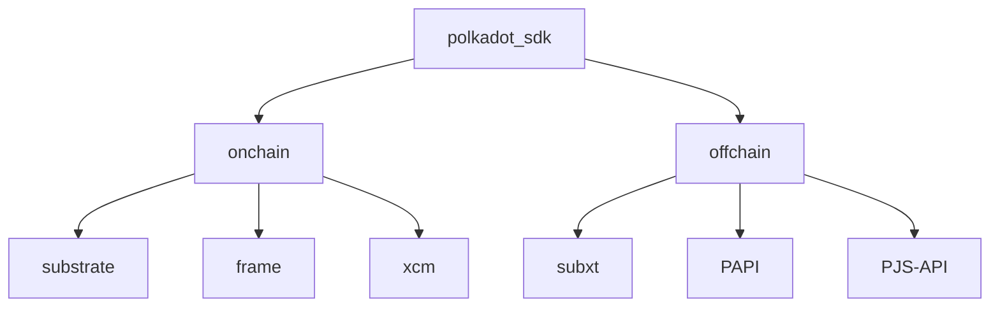

---
{"dg-publish":true,"permalink":"/posts/tech/on-documenting-polkadot-sdk/","hide":true,"created":"2024-07-10T10:48:36.533+01:00","updated":"2024-07-26T10:13:29.595+01:00"}
---

I have been trying to work on `polkadot-sdk` docs for more than a year now. It has been a difficult journey, and admittedly beyond what me and a handful of others can reasonably solve. as a lot of teams are applying to solve the same problems through governance funding and/or DF, I am sharing my [[Posts/Tech/On Documenting `polkadot-sdk`#Retrospective\|#Retrospective]] a year+ of working on this. I will also share how I believe teams getting funding from DF will be most effective in working on this: [[Posts/Tech/On Documenting `polkadot-sdk`#My Wishlist for DF Teams\|#My Wishlist for DF Teams]]. 

All of this is my personal opinion by all means. 
## Retrospective  

> [!Info]  Generally, when I refer to as `polkadot-sdk` here, I mean a subset of the tools in Polkadot SDK that a team typically needs in order to build a *meaninful* and *useful* application on Polkadot cores. That is, at the minimum: FRAME, Substrate, XCM and some offchain library to build a DApp. For example: 

### The Bad  

I would start by acknowledging that that explaining `polkadot-sdk` is hard. 

1. First, There is a lot of Web3 background knowledge that needs to be explained, or assumed. More troublesome, Polkadot itself is a unique Web3 system, and has lots of novel concepts: Origins, Extrinsic, Runtime, Runtime API, Forkless Runtime upgrades and its implications, Host Functions, Metadata, Dispatch, Core (Polkadot Core), Parachain. I am not even opening the jar of all XCM related concepts here. 
2. Rust is a difficult language, and the intricate way we decided to use it does not help.
3. Moreover, the space moves fast. Look at the material around `polakdot-sdk` 2 years ago. A lot of it is less and less relevant today. Heck, even the name `polkadot-sdk` was not around, we are still in the transition of re-establishing `polkadot-sdk` as a replacement of `substrate`[^1].

[^1]: I am of the opinion that we should stop using "*Substrate*" as a keyword, and use "*Polkadot SDK*" as much as possible instead. Substrate should not be used as a standalone term, and instead it is a part of Polkadot SDK. 

### The Good

- The 3rd issue is in general being solved by making Polkadot more [stable](https://forum.polkadot.network/t/stabilizing-polkadot/7175) as a whole. This is a strong promise that we hear from Parity and fellowship: For our developers, we will make Polkadot *stable*, and stable for *a [long time](https://youtu.be/DLofyGI3mw8?si=nJZiVApWTj6ae_Wz&t=1115)*. This also means less changes in `polkadot-sdk`, and therefore increasing the longevity of all educational material that is *henceforth* created.

> [!info] It is worth emphasizing here that this **increased longevity** applies to (new) content that is already correct and up-to-date. 

- 2nd is not solve-able by us per-se, as we are not the creators of Rust and cannot take the decision of using Rust back. But, some of the great steps we have taken to improve this:
	- [`pba-qualifier-exam`](https://github.com/Polkadot-Blockchain-Academy/pba-qualifier-exam) being open-source from the get go.
	- [Rust state-machine](https://www.shawntabrizi.com/rust-state-machine/) tutorial from @shawntabrizi, exactly created to improve this situation.
	- [Trait based programming](https://paritytech.github.io/polkadot-sdk/master/polkadot_sdk_docs/reference_docs/trait_based_programming/index.html) guide for FRAME developers. 
	- (more ideas here, to be published later[^2])
[^2]: I am most excited about exploring the idea of _opinionated `frame_system` variants_. As in, FRAME is not `frame_system`. A runtime can be written with FRAME, and not use `frame_system`. An _opinionated_ `frame_system` can be one that is 1. has more assumptions, and already encompasses multiple pallets in it, such as `timestamp` 2. has fewer generics, and more types hardcoded. 
- 1st issue is mainly what I have tried to solve in the last year. I believe a lot of educational content in the Polkadot space feels incoherent, because it lacks solid foundation. As in, there is a lot of common foundational knowledge, that many educators have to either:
	- Re-explain in their own words, risking fragmentation, or being poorly explained. 
	- Skip, and *assume* the reader already knows it. 

> [!example] I have demonstrated an example of this [here](https://paritytech.github.io/polkadot-sdk/master/polkadot_sdk_docs/meta_contributing/index.html#example-explaining-palletcall). 

And with this hypothesis, I believe there are two tools at the hands of future educators to help with this: 
1. [`polkadot-sdk-docs`](https://paritytech.github.io/polkadot-sdk/master/polkadot_sdk_docs/index.html): A strong foundation of API docs, references on foundational topics, and examples that are guaranteed to be *always correct* (because they live in `polkadot-sdk` repository and are always compiled as a part of its CI). Some of the FAQ that might be asked about this crate is covered in:
	1. [Why Rust Docs?](https://paritytech.github.io/polkadot-sdk/master/polkadot_sdk_docs/meta_contributing/index.html#why-rust-docs)
	2. [Scope](https://paritytech.github.io/polkadot-sdk/master/polkadot_sdk_docs/meta_contributing/index.html#scope) 
	3. [Principles](https://paritytech.github.io/polkadot-sdk/master/polkadot_sdk_docs/meta_contributing/index.html#principles) 
2. [[Talks/Polkadot Blockchain Academy/PBA4 Hong Kong\|Recordings from the Polkadot Blockchain Academy]]. I hope to see the latest Singapore edition be out soon (as the XCM module has had significant changes), but for now the Hong Kong recordings are an excellent resource.
### The Future 

- Finish more foundational knowledge
- [ ] System accounts 
- [ ] Benchmarking and Weights 
- [ ] Compile it to markdown, better looks, better search etc. 
- Explore Converting this to a markdown version for better readability and search and aesthetics. 
- substrate.io 
## My Wishlist for DF Teams 

1. Don't wash and rinse and repackage existing content. Polkadot is moving on, yet I am seeing people still re-packaging "how to launch a parachain on rococo". This is not the trend of Polkadot in 2024 anymore. The hot topics of this year are on-demand on Paseo, OZ templates, omni-node, umbrella crates, and so on. Produce less, but original, novel and new content.
2. Expect better from core devs of polkadot sdk. Foundational knowledge should be explained at the root. Core contributors of `polakdot-sdk` should document their work to the extent that other developers and educations can understand them.  You, as educators, build on top of them, rather than poorly re-explaining them. 
	1. For example, `SignedExtension`, a topic already not well understood by our dev community, is already being replaced with with `TransactionExtension`. It is a reasonable expectation from developers and educators to see some kind of a low level API documentation about this 
3. 