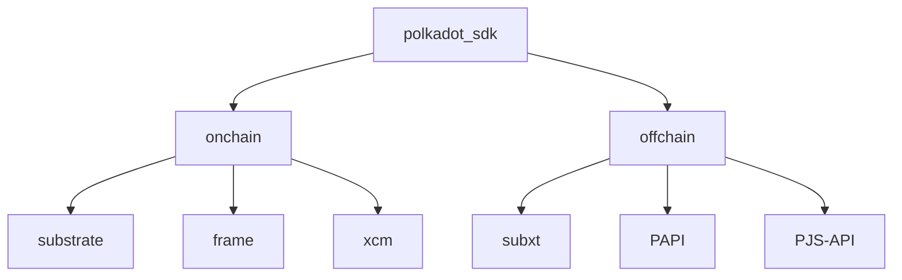

---
{"dg-publish":true,"permalink":"/posts/tech/on-documenting-polkadot-sdk/","created":"2024-07-10T10:48:36.533+01:00","updated":"2024-07-26T12:11:28.739+01:00"}
---

I have been trying to improve `polkadot-sdk`'s documentation for more than a year now. It has been a difficult journey, and admittedly beyond what me and a handful of others can reasonably solve. 

as a lot of teams are applying to solve the same problems through governance and/or [Decentralized Futures](https://futures.web3.foundation/), I am sharing my [[Posts/Tech/On Documenting polkadot-sdk#Retrospective\|retrospective]] of a year+ of working on this. I will also [share](#wishlist) how I believe teams getting funding will be most effective in working on this:. 

I am to a high extent wrapping up my contributions to this effort, and my intention in writing this is to ensure all of my thoughts around it are publicly available, should they be useful to anyone in posterity. All of this is my personal opinion by all means, and not Parity's. 

> [!Info]  Generally, when I refer to as `polkadot-sdk` here, I mean a subset of the tools in Polkadot SDK that a team typically needs in order to build a *meaninful* and *useful* application on Polkadot cores. That is, at the minimum: FRAME, Substrate, XCM and some offchain library to build a DApp. For example: 

## Retrospective  
### The Bad  

I would start by acknowledging that that explaining `polkadot-sdk` is hard. 

1. First, There is a lot of Web3 background knowledge that needs to be explained, or assumed. More troublesome, Polkadot itself is a unique Web3 system, and has lots of novel concepts: Origins, Extrinsic, Runtime, Runtime API, Forkless Runtime upgrades and its implications, Host Functions, Metadata, Dispatch, Core (Polkadot Core), Parachain. I am not even opening the jar of all XCM related concepts here. 
2. Rust is a difficult language, and the intricate way we decided to use it does not help.
3. Moreover, the space moves fast. Look at the material around `polakdot-sdk` 2 years ago. A lot of it is less and less relevant today. Heck, even the name `polkadot-sdk` was not around, we are still in the transition of re-establishing `polkadot-sdk` as a replacement of `substrate`[^1].

[^1]: I am of the opinion that we should stop using "*Substrate*" as a keyword, and use "*Polkadot SDK*" as much as possible instead. Substrate should not be used as a standalone term, and instead it is a part of Polkadot SDK. 

### The Good

- The 3rd issue is in general being solved by making Polkadot more [stable](https://forum.polkadot.network/t/stabilizing-polkadot/7175) as a whole. This is a strong promise that we hear from Parity and fellowship: For our developers, we will make Polkadot *stable*, and stable for *a [long time](https://youtu.be/DLofyGI3mw8?si=nJZiVApWTj6ae_Wz&t=1115)*. This also means less changes in `polkadot-sdk`, and therefore increasing the longevity of all educational material that is *henceforth* created.

> [!info] It is worth emphasizing here that this **increased longevity** applies to (new) content that is already correct and up-to-date. 

- 2nd is not solve-able by us per-se, as we are not the creators of Rust and cannot take the decision of using Rust back. But, some of the great steps we have taken to improve this:
	- [`pba-qualifier-exam`](https://github.com/Polkadot-Blockchain-Academy/pba-qualifier-exam) being open-source from the get go.
	- [Rust state-machine](https://www.shawntabrizi.com/rust-state-machine/) tutorial from @shawntabrizi, exactly created to improve this situation.
	- [Trait based programming](https://paritytech.github.io/polkadot-sdk/master/polkadot_sdk_docs/reference_docs/trait_based_programming/index.html) guide for FRAME developers. 
	- (more ideas here, to be published later[^2])
[^2]: I am most excited about exploring the idea of _opinionated `frame_system` variants_. As in, FRAME is not `frame_system`. A runtime can be written with FRAME, and not use `frame_system`. An _opinionated_ `frame_system` can be one that is 1. has more assumptions, and already encompasses multiple pallets in it, such as `timestamp` 2. has fewer generics, and more types hardcoded. 
- 1st issue is mainly what I have tried to solve in the last year. I believe a lot of educational content in the Polkadot space feels incoherent, because it lacks solid foundation. As in, there is a lot of common foundational knowledge, that many educators have to either:
	- Re-explain in their own words, risking fragmentation, or being poorly explained. 
	- Skip, and *assume* the reader already knows it. 

> [!example] I have demonstrated an example of this [here](https://paritytech.github.io/polkadot-sdk/master/polkadot_sdk_docs/meta_contributing/index.html#example-explaining-palletcall). 

And with this hypothesis, I believe there are two tools at the hands of future educators to help with this: 
1. [`polkadot-sdk-docs`](https://paritytech.github.io/polkadot-sdk/master/polkadot_sdk_docs/index.html): A strong foundation of API docs, references on foundational topics, and examples that are guaranteed to be *always correct* (because they live in `polkadot-sdk` repository and are always compiled as a part of its CI). Some of the FAQ that might be asked about this crate is covered in:
	1. [Why Rust Docs?](https://paritytech.github.io/polkadot-sdk/master/polkadot_sdk_docs/meta_contributing/index.html#why-rust-docs)
	2. [Scope](https://paritytech.github.io/polkadot-sdk/master/polkadot_sdk_docs/meta_contributing/index.html#scope) 
	3. [Principles](https://paritytech.github.io/polkadot-sdk/master/polkadot_sdk_docs/meta_contributing/index.html#principles) 
2. [[Talks/Polkadot Blockchain Academy/PBA4 Hong Kong\|Recordings from the Polkadot Blockchain Academy]]. I hope to see the latest Singapore edition be out soon (as the XCM module has had significant changes), but for now the Hong Kong recordings are an excellent resource.
### The Future 

- There are still a number of core topics around `polkadot-sdk` that I am personally not content with the degree of documentation around them, and I intend to provide those as soon as I can: 
	- [ ] How accounts are stored and behave in `frame-system` . 
	- [ ] Benchmarking and Weights 
	- [ ] Fees: Why they exist, under which conditions one can be exempted, and what tools FRAME provides for this. This should include the new `feeless_if` macro, and incorporate new personhood ideas presented by Gav in Polkadot Decoded 2024[^3].
[^3]: Explaining the typical example of allowing free transactions if one has a valid personhood certificate. 
- Explore converting this body of information to a markdown version for better readability and search and aesthetics. Possibly branded as a "*Mastering Polkadot SDK Book*". 
## Wishlist

This is how I think teams applying for funding regarding documentation will be most impactful. 
### Forward looking 

* I wish to see more content created around the latest topics in `polkadot-sdk`, rather than rinsing and re-packaging existing ones. Of course, a large part of the old materials that we currently have are still relevant, but they should be carefully handpicked and vetted. The topics of the year that are exciting to me are:
	* It is going to be all about **agile-coretime** going forward, especially on-demand. A number of great tutorials should start with writing a pallet, adding it to a parachain-ready tempalte, and end at acquiring one on-demand block on Paseo, and producing a block. [This guide](https://wiki.polkadot.network/docs/build-guides-template-basic) by Bader from Web3 Foundation is along these lines.
	* Use of new developer toolings that simplify Developer Experience: [Tanssi](https://www.google.com/search?q=tanssi+network&oq=Tanssi+network&sourceid=chrome&ie=UTF-8), [PoP](https://pop.r0gue.io/), etc.[^5] 
	* [OZ Templates](https://github.com/OpenZeppelin/polkadot-runtime-templates)
	* [`OmniNode`](https://forum.polkadot.network/t/polkadot-parachain-omni-node-gathering-ideas-and-feedback/7823)
	* [Umbrella crates](https://paritytech.github.io/polkadot-sdk/master/polkadot_sdk_docs/reference_docs/umbrella_crate/index.html)
	* The above 3 imply we can massively simplify our templates to 
		1. Use the umbrella crates, instead of dozens of crates 
		2. Use omni-nodes, and be mere _Runtime Templates_, removing the entire `/node` directory.
	* [Transaction/Signed Extension](https://github.com/paritytech/polkadot-sdk/pull/3685), and other features *that are unique* to what you can do a blockchain, and you cannot do in a smart contract environment. 
		* [Where contracts fail, and runtimes/chains are needed - Ecosystem - Polkadot Forum](https://forum.polkadot.network/t/where-contracts-fail-and-runtimes-chains-are-needed/4464)
		* [polkadot\_sdk\_docs::reference\_docs::runtime\_vs\_smart\_contract - Rust](https://paritytech.github.io/polkadot-sdk/master/polkadot_sdk_docs/reference_docs/runtime_vs_smart_contract/index.html)
	* [Personhood](https://youtu.be/xXS9w4wqHWo?si=O8am8htFesUQzj97&t=1555).  

[^5]: I am sure more exists, yet I am not familiar with them, see [[Posts/Tech/On Documenting polkadot-sdk#Awesome Lists\|Awesome Lists]]. 

All in all, I suggest educators to focus on creating tutorials on forward looking topics, even if it means producing less.

You might argue that a lot of this is pretty advanced, and hard to grasp for those who are outside the circle of core contributors of `polkadot-sdk`, and you are right about that. And this brings me to the next point.

### Expect Better 

****Expect better*** from core devs of `polkadot-sdk`. Foundational knowledge that explains the basics of an API and how it is intended to be used is not a nice-to-have, but rather a must. Core developers should provide the foundation for educators and technical writers in the space to create new content about the latest features. I hope to see most of this low level documentation to live in `polkadot-sdk-docs`. 
* Finally, to make this process fruitful, you, as educators, build on top of the core documentation and backlink to it. This creates a strong mutual incentive 

> [!example] For example, `SignedExtension`, a topic that is arguably already not well understood by our dev community, is being replaced with with `TransactionExtension`. We should ensure that this new feature comes with all the right foundational documentation needed for it to be used in the ecosystem, taught by our educators. 

### Awesome Lists 

There are so many cool developer tools out there, yet I am surprised to not often find them. I think the best way to aggregate these is indeed is a standard [`awesome-list`](https://github.com/sindresorhus/awesome). We have an [old one that is no longer maintained by Parity](https://github.com/substrate-developer-hub/awesome-substrate), and a new community driven [`awesome-dot`](https://github.com/haquefardeen/awesome-dot). I hope to see a consolidation of the two into `awesome-polkadot`, with a dedicated maintainer. 